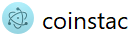
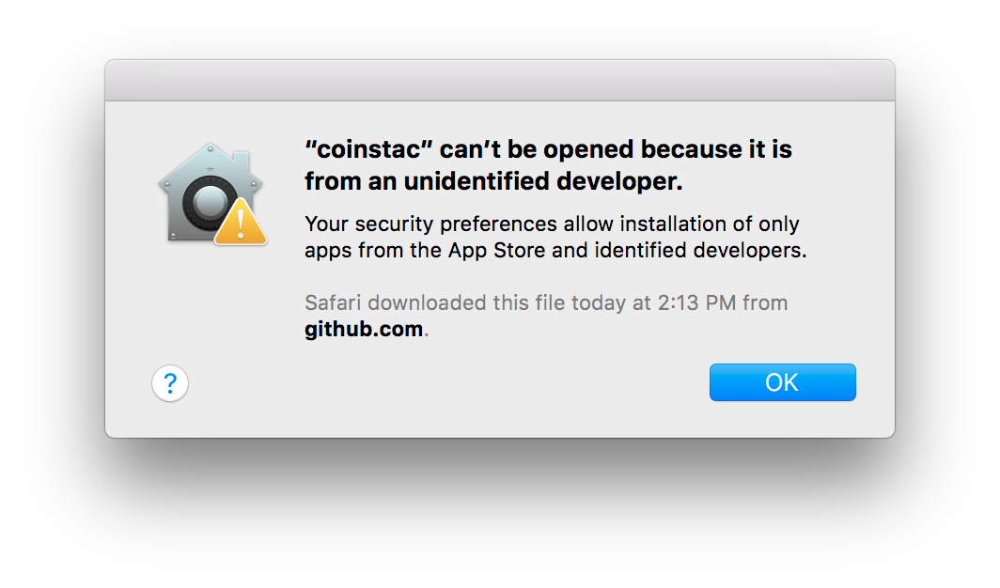
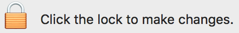

Introduction
------------

The Collaborative Informatics and Neuroimaging Suite Toolkit for
Anonymous Computation, User Interface (COINSTAC) is software created to
foster collaborative research by removing large barriers to traditional
data-centric collaboration approaches. It is a desktop application that
can be run on the major three operating systems (Windows, Mac, and
Linux).

Installation
------------

To install and run COINSTAC, follow the below instructions:

1.  Verify System Requirements

2.  Install Docker

3.  Download and Run COINSTAC Application

Verify System Requirements
--------------------------

Use a Mac with OS X 10.12 or higher. Before starting, please check that
your computer meets the [[System
Requirements]{.underline}](https://docs.docker.com/docker-for-mac/install/#what-to-know-before-you-install)
for Docker.

Install Docker
--------------

Install Docker from the link below.

[[https://store.docker.com/editions/community/docker-ce-desktop-mac]{.underline}](https://store.docker.com/editions/community/docker-ce-desktop-mac)

### Verify Installation

Check that docker is installed by opening a terminal and typing:

> docker -v

You should see a similar message, probably with a different version and
build:

> Docker version 18.03.1-ce, build 9ee9f40

### Verify Docker is Running

Before starting COINSTAC, verify that Docker is running on your computer
by using one of the methods below.

#### Method \#1

You can verify that Docker is running by hovering over the Docker icon
{width="0.2864588801399825in"
height="0.2864588801399825in"} on your taskbar. You should see a message
that Docker is running.

#### Method \#2

Open a terminal and type:

> docker ps

You should see an output like this:

> CONTAINER ID IMAGE COMMAND CREATED STATUS PORTS NAMES

If you see an error message, then you have to start Docker.

### Running Docker

To run Docker:

-   Click on the Launchpad
    {width="0.29069772528433946in"
    height="0.29069772528433946in"} in your taskbar at the bottom of the
    screen.

-   Find Docker
    {width="0.4870308398950131in"
    height="0.4870308398950131in"}in your list of applications and click
    on it

Download and Run COINSTAC Application
-------------------------------------

### Download

To download the COINSTAC application, do the following:

-   Go to this page and download the latest release:

<https://github.com/MRN-Code/coinstac/releases/>

-   Download the file named **coinstac-darwin-x64.zip**.

-   After the download is complete, extract the zip file to a folder on
    your computer.

### Give Permission to Run Application

After extraction, open the extracted folder and double click on the file
named {width="0.8195592738407699in"
height="0.21606627296587927in"}

You will be prompted with a warning that says this software is from an
unverified developer. This warning will only be issued once every time
you open a new version of COINSTAC. We have plans to remove it in the
future.

{width="4.583333333333333in"
height="2.2291666666666665in"}

You will have to do the following:

-   Click on the Apple icon {width="0.20833333333333334in"
    > height="0.20833333333333334in"} in the top-left corner of your
    > screen

-   Click System Preferences.

-   Click on Security & Privacy.

-   You will see a warning that coinstac was blocked because it was not
    > from an identified developer.

> {width="6.5in"
> height="5.5784722222222225in"}

-   Click on the Open Anyway button

    -   If that does not work, do the following:

        -   Click on the lock in the lower left-hand corner.

> {width="2.5156255468066493in"
> height="0.35238298337707785in"}

-   Enter your password.

-   Click on the Open Anyway button

```{=html}
<!-- -->
```
-   Close this window.

### Run Application

Next, go back to the folder where you extracted COINSTAC and double
click on the
{width="0.8195592738407699in"
height="0.21606627296587927in"} file again.
